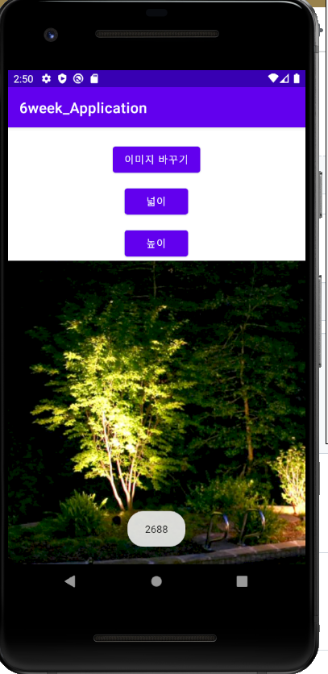

# 20173030_psy_androidApp

## 1주차 

## 2주차    
  - 출석과제 
  
</img>

## 3주차 
   - 1번 과제

 </img>

   - 2번 과제
   
   
  </img>

## 4주차

   - 유튜브 개선
     : 코로나 19로 인해 집에 머무는 시간이 많아져 영상을 찍거나, 보는 사람이 급증해 많이 이용, 많은 사람들이 이용하기에 더욱 편리하게 해줄 앱
     1. <광고를 카테고리로 나눠 선정적, 폭력적 등의 유해한 영상들을 설정을 통해 광고는 뜨지만 선정,폭력 등의 광고는 뜨지 않게 설정> 유튜브 프리미엄이라는 유료로 광고가 없이 영상을 보는 사람들도 있지만, 이 유료 멤버십 비용이 부담 되는 사람들을 위한 것이다.
     2. <가짜 뉴스가 난무한 유튜브, 영상 업로드 할 때 카테고리 선택하게 해 뉴스를 선택한다면, 영상 앞머리나 설명란 등에 "허위정보일 경우 법적 책임-" 등의 문구를 추가하는 것> 누구나 영상을 올리는 점이 장점과 단점을 확실히 나뉘게 한다. 단점이 여기서 드러나는데, 누구나 올릴 수 있다보니 자신의 생각 혹은 섣부른 정보로 자극적이게 영상을 만들어 조회수를 올리는 경우가 있다. 건강한 영상들을 만들기 위함이다.
     3. <영상 밑 하단 수화 추가> 생각보다 TV에서는 뉴스 정도만 수화통역사가 의사소통을 한다. 유튜브에서 자동자막을 시행하고 있긴 하지만, 잘 되지 않는 경우가 대부분인 것 같다. 우리가 해외 영상을 볼 때 한국자막을 켜듯이 장애인분들도 수화를 켜 볼 수 있게 한다. 또한, 그렇게 도입이 된다면 비장애인분들도 수화에 관심을 갖지 않을까 생각한다. 수화 통역사는 가상의 인물로 한다.>

    - 카메라 모음 앱
     : 사진에 대한 정보, 카메라 어플, 보정 어플 등이 한 곳에 모여있는 앱이다.
     1. 지그재그나 브랜디를 보면 여러 쇼핑몰들이 한 곳에 모여 가격 비교도 쉽고, 한눈에 보기가 좋다. 카메라도 자신이 원하는 필터 혹은 보정, 편집 등을 여러 앱을 켜가며 하는 경우가 있어 그 부분은 핸드폰 용량을 차지 하는 경우가 대다수이다. 이를 편리하게 만들기 위해서 쇼핑몰처럼 입점(?)할 어플들을 모아 하나의 앱에 넣는 것이다.
     2. 핀터레스트 처럼 여러 사진들도 찾을 수 있게끔한다. 대신, 저작권의 문제가 있을 수 있어 자신이 찍은 사진이어야 하고, 여기에 올라온 사진들을 사용하는 것 괜찮지만, 비용이 발생하는 부분은 불가능하다. 라고 명시한다. 
     3. 자신이 찍은 사진에 대해 어떻게 찍었는지 조그마한 팁이나, 보정 방법등을 설명란이나, 따로 댓글을 달 수 있게끔 한다.

:  두가지 선택지를 고민 중이라 만들기 시작할 때에 하나를 선택해 만들겠습니다 :D 
  

## 5주차
</img> </img>

## 6주차  
</img> </img>

## 7주차  
</img> 
